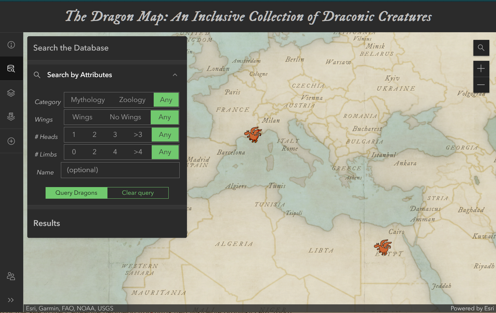

# geog576_midterm
A repo for UW-Mad Geog 576 Midterm Project

## Project Summary
This project is a web map using ArcGIS Online JavaScript code to create a responsive web-map with JavaScript and various hosted datasources, incorporating an editable feature layer and a legend. 

My project is a database of dragons across the world, showing the blurry line bewteen folklore, history, myth, and biology. I have included some data points for dragons as a starter to the database, but the intention for this website is to share with others to hopefully enrich the database from multiple perspectives, cultures, and backgrounds.

Layers include:
<ul>
  <li>Editable <a href = "">dragon feature layer</a> created by me.</li>
  <li><a href="https://services9.arcgis.com/IkktFdUAcY3WrH25/arcgis/rest/services/GlobalTerrRaR_025deg/FeatureServer">Global Terrsetial Species Richness and Rarity Patterns (0.25 degree)</a> by Map of Life on the Living Atlas.</li>
  <li><a href="https://cumulus.tnc.org/arcgis/rest/services/Atlas/TerrestrialMaps/MapServer/9 ">Number of Terrestrial Land and Snake Species</a> by tboucher</a> on The Living Atlas.</li>
  <li>Basemap: <a href="https://www.arcgis.com/home/item.html?id=83ebb96f9f99446085888bb5341c5afd">Georgian Web Map</a> created by j_nelson.</li>
</ul>

### Project Website
This project is hosted live on github pages: https://steslowj.github.io/geog576_midterm/

### Website Screenshot

